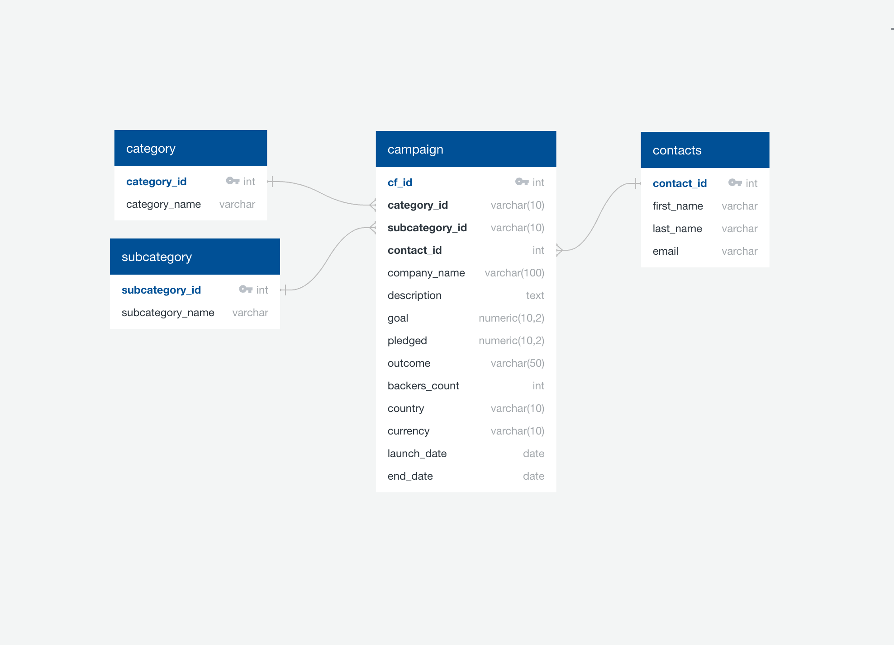
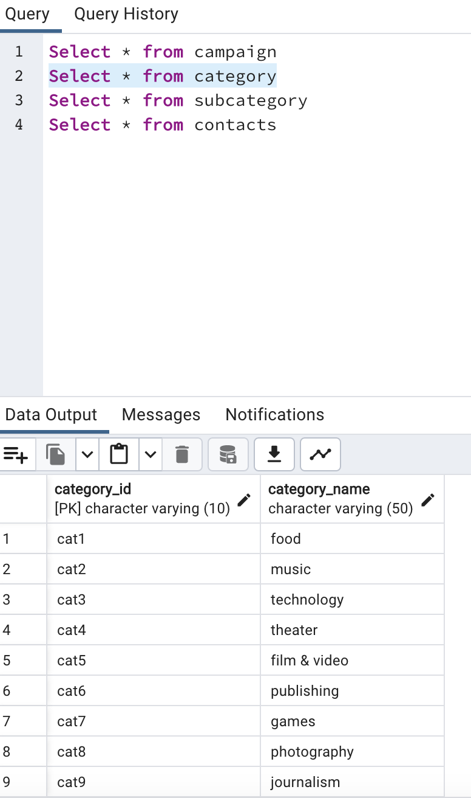
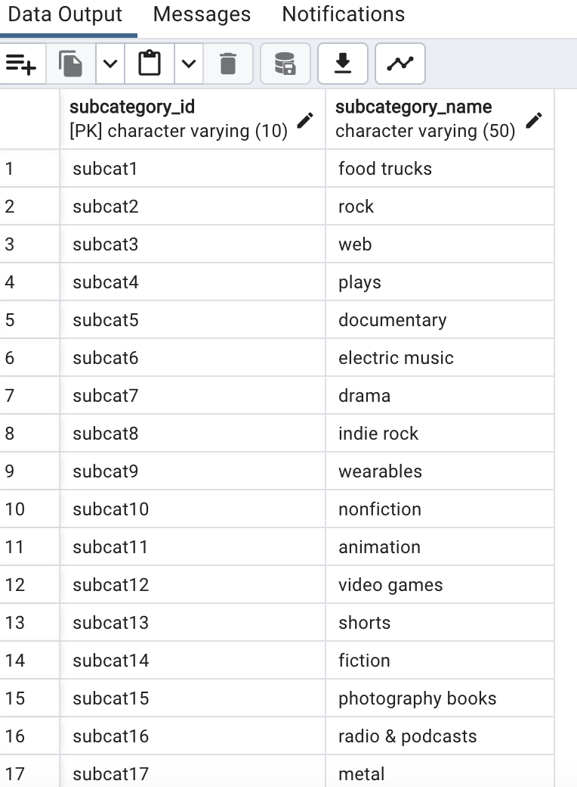
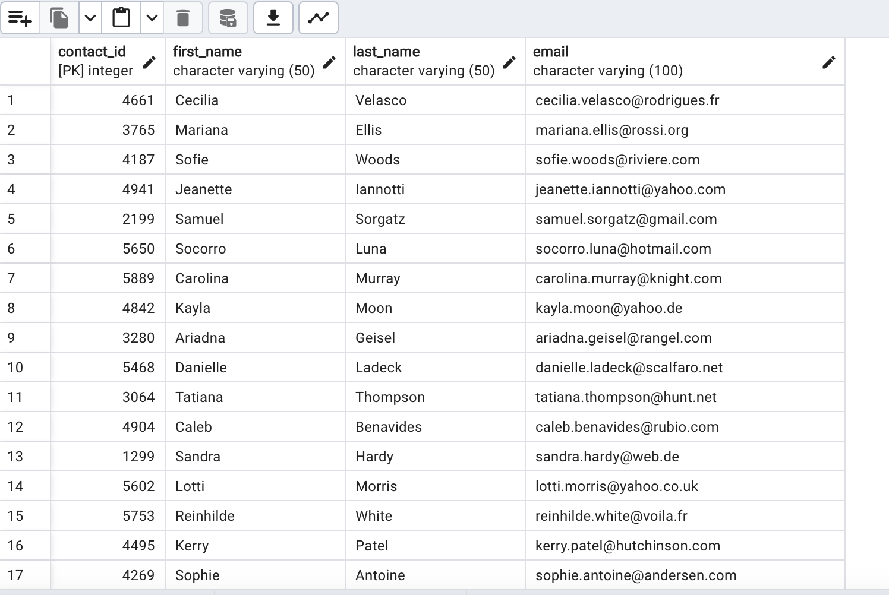
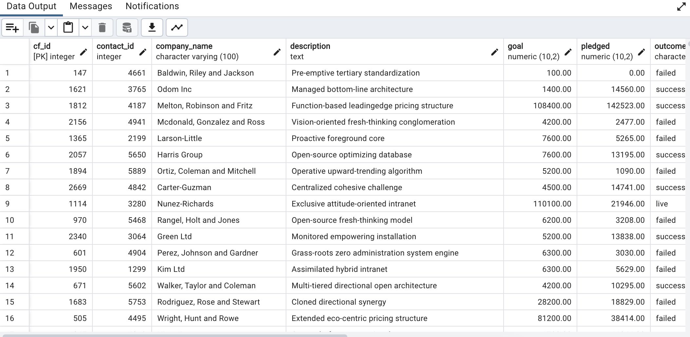

# Project 2: ETL Pipeline

## Table of Contents
- [About](#about)
- [Key Steps](#key-steps)
- [Resources](#resources)
- [Database Tables](#database-tables)

## About
In this project, I implemented an ETL (Extract, Transform, Load) pipeline using Python, Pandas, and PostgreSQL. The goal was to import data from an Excel file, transform it to CSV files, and load the CSV files into a PostgreSQL database.

## Key Steps:
1. **Created Category and Subcategory DataFrames**
   - Imported data from crowdfunding.xlsx using `pd.read_excel`.
   - Created a category DataFrame with "category_id" and "category" columns.
   - Created a subcategory DataFrame with "subcategory_id" and "subcategory" columns.
   

2. **Created the Campaign DataFrame**
   - Renamed and dropped unnecessary columns.
   - Changed data types (e.g., string to float, datetime).
   - Performed a SQL left join on category and subcategory tables to create a merged dataframe.

3. **Created the Contacts DataFrame**
   - Transformed data from contacts.xlsx into a contacts dataframe using Python dictionary methods.
   - Split the "name" column into first and last names.
   - Cleaned and exported the DataFrame as [contacts.csv](Resources/contacts.csv).

4. **Created the Crowdfunding Database**
   - Designed the database schema based on the ERD generated using [Quick DBD](http://www.quickdatabasediagrams.com/).

   

   - Created tables with appropriate data types, primary keys, and foreign keys.
   - Imported data from CSV files into the PostgreSQL database.
   - Verified data integrity by running SELECT statements.

## Resources
- [category.csv](Resources/category.csv)
- [campaign.csv](Resources/campaign.csv)
- [subcategory.csv](Resources/subcategory.csv)
- [contacts.csv](Resources/contacts.csv)

## Database Tables
<figure>
    <figcaption>Category Table</figcaption>
        
</figure>
 
<figure>
    <figcaption>Subcategory Table</figcaption>
    
</figure>
 
<figure>
    <figcaption>Contacts Table</figcaption>
    
</figure>
 
<figure>
    <figcaption>Campaign Table</figcaption>
    
</figure>
